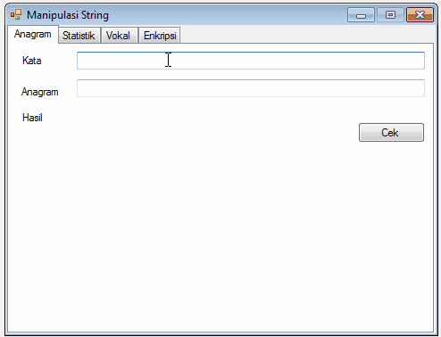
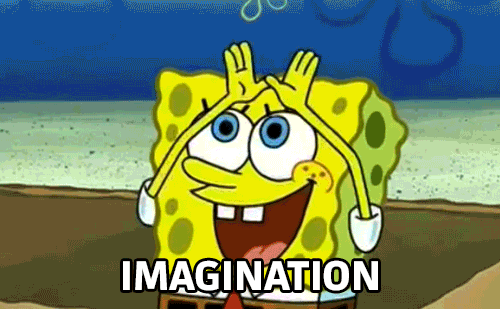
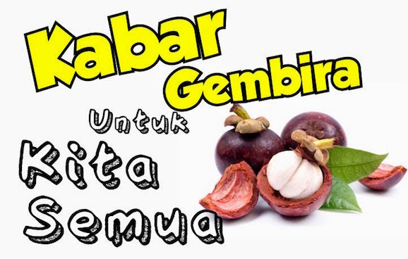

# Tugas Manipulasi String

## WARNING-DISCLAIMER
Mohon baca petunjuk pengerjaan dengan seksama

## Soal
Buatlah sebuah aplikasi tentang manipulasi string sesuai dengan gambar di bawah
ini:

Contoh hasil akhir aplikasi **ManipulasiString.exe**

## Petunjuk
Gunakan imajinasimu

## Cara Pengerjaan

Anda tidak perlu menggunakan Github untuk mengumpulkan tugas

- Buka file tugas-2015-04.sln dalam repositori ini **jangan membuat project
  baru!!!**, template project menggunakan Visual Studio 2010 (Silahkan gunakan
  menu upgrade jika anda menggunakan versi Visual Studio yang lebih baru)
- Kerjakan tugas sesuai dengan deskripsi soal.
- Pengumpulan tugas dilakukan dengan mendemokan secara langsung di ruangan saya
  pada tanggal 26 Oktober 2015 07:00 - 23:59 WIB
- Laporan tugas ditulis tangan, berisi source code + deskripsi alur program
- Jika ada pertanyaan silahkan buat isu baru di [Repositori Tugas](https://github.com/polinema-gui/tugas-2015-04)

# Selamat Mengerjakan

